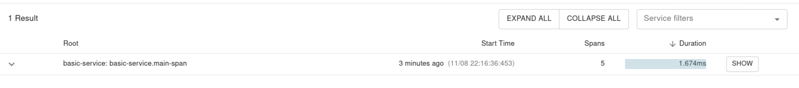
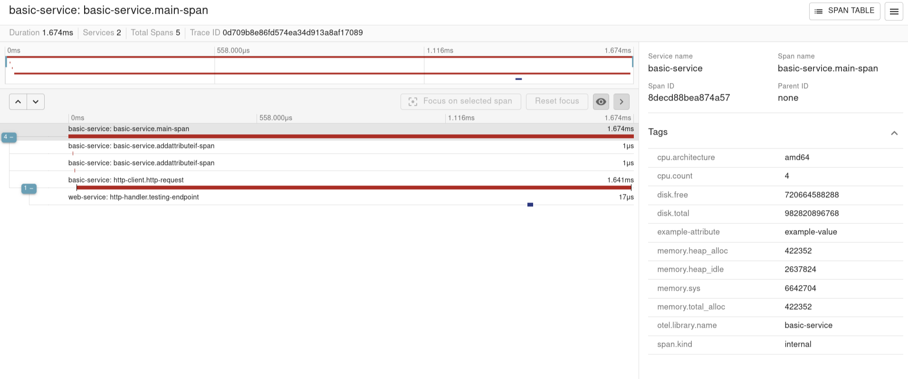

## Basic Web Example
This is an example of how to initialize and trace a basic WEB service.  You can look at the code in `main.go` in the `examples/basic` folder to see the setup and propagation code.

In the `examples/basic/web` folder, you can see how we extract the HTTP context.

### Start the basic web example service
```bash
make basic-example-up
```

### Stop the basic web example service
```bash
make basic-example-down
```

### View Traces in Zipkin
* Navigate to: `http://localhost:9411/zipkin`
* Click on the `RUN QUERY` button
* There should be one result with a `SHOW` button you can press

    
* Press the `SHOW` Button and the spans created through the services will be visualized


#### Interpreting the Results
In the example, the top span is the Trace Parent.  The Parent ID field on the right side of the page should say `none`.  This confirms this is a root or Parent Trace.  For proper trace propagation all subsequent spans related to this trace should use the SPAN ID of this root span as the Parent-ID.  By doing this, all spans that should be part of the same logic flow will be linked together.  

As you click on the spans, you will see specific informaiton about the span on the right side.  In this example we propagate the trace context across a service boundry from the BASIC service to the WEB service using our HTTP Trace Propagator and Extractor.  This shows an indention as it crosses boundaries.
